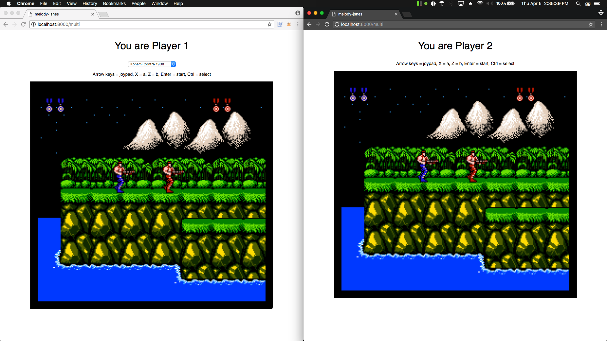

# NEScat

  

NEScat is a website to play NES or Nintendo Entertainment System games in a browser in singleplayer and online multiplayer modes with only JavaScript, no plugins necessary. It is based on [melody-jsnes by olahal](https://github.com/olahol/melody-jsnes) and [jsnes by bfirsh](https://github.com/bfirsh/jsnes). The server side components were programmed in Go with Gin handling the web aspects and Melody using websockets to allow multiplayer.

